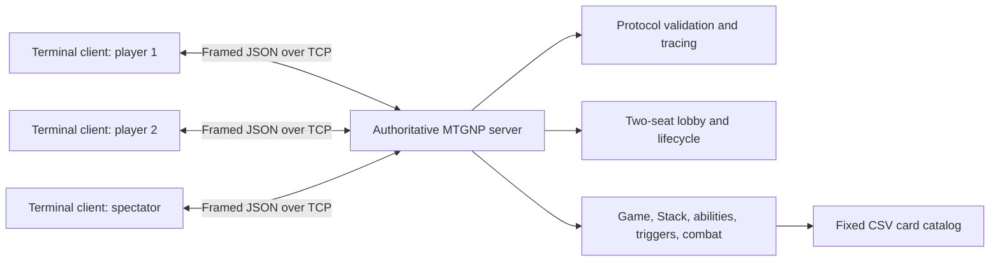
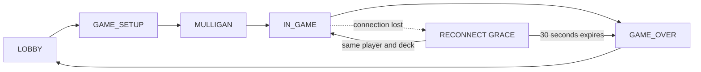

# MTGNP

MTGNP is a terminal-based, two-player game of Magic: The Gathering played over
a TCP network. Both players connect to an authoritative server that manages
decks, hidden hands, turns, mana, spells, the Stack, combat, win conditions,
reconnection, and repeat games. A read-only spectator can follow the match
without seeing either player's private hand.

## Demo Video

[Watch the MTGNP demo video on Google Drive](https://drive.google.com/file/d/1pk8WK4YVdOSh5IGX2owpp9axPIXT0f_D/view?usp=sharing)

## Build and test

Open PowerShell in the `MTGNP` directory:

```powershell
$env:PYTHONPATH = "src"
python -m unittest discover -s tests -v
```

An editable install is optional:

```powershell
python -m pip install -e .
```

After an editable install, `mtgnp-server` and `mtgnp-client` may be used in
place of `python -m mtgnp.server` and `python -m mtgnp.client`.

### Regenerate the submission PDF

The game has no third-party runtime dependency. Rebuilding the documentation
PDF additionally requires ReportLab:

```powershell
python -m pip install reportlab
python scripts/build_readme_pdf.py
```

The stable output path is `output/pdf/README.pdf`. Regenerate it after filling
in the Work Distribution Matrix or changing the README.

## Run a local game

Open three PowerShell terminals in this directory and set the source path in
each terminal:

```powershell
$env:PYTHONPATH = "src"
```

Start the authoritative server:

```powershell
python -m mtgnp.server --verbose
```

Start player 1:

```powershell
python -m mtgnp.client --player-id alice --deck decks/stack_demo_red_green.json --auto-keep --verbose
```

Start player 2:

```powershell
python -m mtgnp.client --player-id bob --deck decks/stack_demo_blue_black.json --auto-keep --verbose
```

Optional spectator client(s):

```powershell
python -m mtgnp.client --spectator --host 127.0.0.1 --verbose
```

The server always reserves exactly two player seats. After those seats are
occupied, additional connections receive a spectator role rather than a third
player seat. A spectator receives sanitized authoritative state, may send
`PING`, and receives `ILLEGAL_ACTION` for gameplay PDUs.

`--verbose` is the required demo mode. It prints every complete PDU sent and
received with direction, peer, type, sequence number, timestamp, and formatted
JSON. PING and PONG retain every field but use one compact line each. During
interactive verbose play, each heartbeat pair is separated from gameplay by a
client-side `+` border. A matched PONG is followed by a one-line game-context
summary and a restored input prompt so background heartbeat output does not
obscure the current phase. Remove the flag for normal play. Add `--auto-pass`
to both clients for an unattended protocol smoke test.

For a LAN game, run the server on one computer, allow inbound TCP port 4444 in
the host firewall, determine the host's LAN IPv4 address, and give both clients
that address:

```powershell
python -m mtgnp.client --host 192.168.1.10 --player-id alice --deck decks/stack_demo_red_green.json --auto-keep --verbose
```

## Terminal controls

At a priority prompt the client accepts:

```text
pass
concede
land CARD_ID
cast CARD_ID [TARGET ...]
activate SOURCE_ID ABILITY_INDEX [TARGET ...]
```

Examples:

```text
land mountain_001
cast lightning_bolt_001 bob
cast counterspell_001 stk_0001
cast doom_blade_001 goblin_guide_001
activate prodigal_sorcerer_001 0 bob
activate millstone_001 0 bob
```

Mana payment is inferred from the catalog and paid by atomically tapping legal
sources. Diagnostic overrides are available:

```text
cast doom_blade_001 goblin_guide_001 --mana B=1,X=1
activate millstone_001 0 bob --mana X=2
```

Combat prompts accept attacker IDs separated by spaces, `none`, and blocker
pairs such as `phantasmal_bear_001=goblin_guide_001`. The attacker is prompted
for damage order when several creatures block one attacker.

## Rules behavior that may not be obvious

- The first player skips only the Draw Step of turn 1. The second player draws
  on turn 2, and the first player begins drawing on turn 3.
- Playing a land is not casting a spell and does not require mana. Only the
  active player may play one land during either of that player's Main Phases.
- Receiving priority during the opponent's turn permits responses such as
  Instants, but it does not make the responding player the active player.
- Lands remain tapped until their controller's next Untap Step. The terminal's
  `Available mana` line counts currently untapped mana sources.
- Both players must pass consecutively to resolve the top Stack item or advance
  an empty priority window.
- The client sends `PING` every 30 seconds and waits up to 10 seconds for the
  matching `PONG`. This timeout applies to heartbeat replies, not to a turn or
  phase. A priority grant has its own 60-second action deadline.
- Goblin Guide and Monastery Swiftspear have haste in the fixed catalog, so
  they may attack on the turn they enter. The catalog and normative rules take
  precedence over any contradictory walkthrough example.

## Disconnect and reconnect

An unexpected in-game connection loss pauses the authoritative game and
reserves that seat for 30 seconds. The server cancels the outstanding priority
deadline while paused.

To reconnect, rerun the same client command before the grace period ends. The
`PLAYER_READY` PDU acts as the reconnect handshake and must contain the exact
same player ID and ordered deck list. The server then:

1. verifies the reserved identity and deck;
2. sends fresh personalized authoritative state;
3. issues a fresh priority, combat, trigger, mulligan, or discard token; and
4. continues the original game without reshuffling or resetting it.

A changed identity or deck is rejected and the reservation remains active. If
the timer expires, the connected opponent receives `GAME_OVER` with reason
`DISCONNECT`. The grace duration can be configured for demonstrations:

```powershell
python -m mtgnp.server --reconnect-grace 30 --verbose
```

## Architecture



The clients send intent only. They never determine whether an action succeeds
or calculate a winner. Every accepted mutation occurs in the server game
engine, and each `GAME_STATE_UPDATE` replaces the client's local view.

The game lifecycle is:



## Implemented effects

The base rubric requires at least five effects. The implementation exceeds
that gate with spell effects, activated abilities, and triggered abilities.

- Spells: Lightning Bolt, Shock, Lava Spike, Flame Slash, Searing Spear,
  Unsummon, Counterspell, Cancel, Negate, Giant Growth, Doom Blade, Naturalize,
  Terror, Raise Dead, Rampant Growth, Dark Ritual, Incinerate
- Activated abilities: Prodigal Sorcerer, Royal Assassin, Millstone, Rod of Ruin
- Triggered abilities: Goblin Guide, Monastery Swiftspear, Phantasmal Bear,
  Gray Merchant of Asphodel, Gravedigger

Dedicated demonstrations are available in `decks/ability_demo_*.json` and
`decks/trigger_demo_*.json`. Optional milestone O1A can be played with
`decks/optional_spells_red.json` and `decks/optional_spells_blue.json`.

## Test coverage

Automated tests cover catalog reconciliation, all PDU shapes, malformed and
fragmented framing, hidden information, mulligans, turn transitions, draws,
land and mana rules, Stack ordering and countering, state-based actions,
combat, activated and triggered abilities, timeouts, heartbeat behavior,
concession, same-connection restart, reconnect success, reconnect rejection,
and reconnect expiry.

The external checks in `docs/INTEROPERABILITY_TEST_MATRIX.md` must be completed
on the actual demo machines. They are deliberately not marked as passed in
advance.

## Known limitations and RFC interpretations

- MTGNP defines reconnect as required but defines no reconnect/session PDU.
  This implementation reuses `PLAYER_READY` with the same player ID and exact
  ordered deck. This is an implementation-defined extension using an existing
  PDU rather than adding a non-standard message type.
- Player IDs are not authenticated because MTGNP 1.0 defines no authentication.
  The reconnect check prevents accidental seat takeover, not a malicious peer
  that already knows the original player ID and deck.
- A legal deck may contain fewer than seven cards. Setup draws all cards that
  are available; a later required draw from an empty library loses the game.
- Each physical card instance ID may occur in only one submitted deck.
- Each physical server-to-client PDU receives a distinct monotonically
  increasing server sequence number, including separate broadcast copies. The
  explicit Section 11 exception reissues the current token unchanged after a
  rejected action while that player still holds priority.
- Seventeen spell effects and selected activated/triggered abilities are
  supported. Full behavior for every catalog card is optional bonus work and
  is not claimed because O1C-O1F were cancelled.
- Exactly two connections receive player seats. Further connections become
  read-only spectators. This optional O3 extension interprets the base rule
  about refusing additional connections as refusing additional *players*;
  graders who require every third TCP connection to be closed should note this
  intentional deviation.
- The player and spectator clients are terminal-based. A graphical interface
  was cancelled and is not part of the submission.

## Work Distribution Matrix

The group reports an equal contribution model. All three members shared design,
implementation, review, debugging, gameplay testing, and demo preparation.
The matrix records that shared ownership; commit counts alone are not treated
as a measure of contribution.

| Task / Feature | King Mejia | Jose Honrado | Walt Hutchison |
| --- | --- | --- | --- |
| TCP Server: connection handling, framing, dispatch | Equal contribution | Equal contribution | Equal contribution |
| Game lifecycle: LOBBY, GAME_SETUP, MULLIGAN logic | Equal contribution | Equal contribution | Equal contribution |
| Turn & phase engine (all phases/steps, transitions) | Equal contribution | Equal contribution | Equal contribution |
| Priority & Stack logic, spell/ability resolution | Equal contribution | Equal contribution | Equal contribution |
| Combat system (attackers, blockers, damage) | Equal contribution | Equal contribution | Equal contribution |
| Client implementation & state rendering | Equal contribution | Equal contribution | Equal contribution |
| PDU serialisation/deserialisation (all 25 PDU types) | Equal contribution | Equal contribution | Equal contribution |
| Error handling, PING/PONG heartbeat, disconnect logic | Equal contribution | Equal contribution | Equal contribution |
| Verbose mode (client + server PDU logging, toggle on/off) | Equal contribution | Equal contribution | Equal contribution |
| Testing & interoperability | Equal contribution | Equal contribution | Equal contribution |
| README / documentation / AI disclosure | Equal contribution | Equal contribution | Equal contribution |

## AI Usage

The project used the following AI tools:

- **OpenAI Codex:** analyzed the MTGNP specification, rubric, and CSV catalog;
  reviewed the implementation against the rubric; explained rules, priority,
  heartbeat, and branch-integration behavior; helped draft and revise Python
  code and automated tests; improved compact verbose heartbeat output and
  prompt restoration; diagnosed gameplay issues; and prepared submission and
  demo documentation.
- **Anthropic Claude:** helped draft and refine the video-demo script so the
  required rubric evidence could fit within the eight-minute limit, and
  assisted with selected optional-milestone implementation and review work.

AI output was not accepted blindly. The group reviewed the changes, performed
gameplay tests, ran the automated suite, and retained responsibility for the
implementation and submission. No other AI tool is reported as used.

## Dependencies and project tools

- The game runtime uses only the Python standard library.
- ReportLab is used only by `scripts/build_readme_pdf.py` to produce the
  submission PDF; it is not required to run the game.
- Git and GitHub are used for version control, branch integration, and group
  collaboration.

## Project documentation

- `docs/FOUNDATION_DECISIONS.md` - catalog and RFC interpretation decisions
- `docs/TRANSPORT_DESIGN.md` - TCP framing, connection wrapper, and tracing
- `docs/LOBBY_DESIGN.md` - lobby and ready validation
- `docs/GAME_SETUP_DESIGN.md` - setup, hidden state, and mulligans
- `docs/TURN_ENGINE_DESIGN.md` - turns, priority, draws, and cleanup
- `docs/STACK_AND_SPELLS_DESIGN.md` - lands, mana, spells, Stack, and effects
- `docs/COMBAT_DESIGN.md` - combat validation and damage
- `docs/ACTIVATED_ABILITIES_DESIGN.md` - activated-ability registry and flow
- `docs/TRIGGERED_ABILITIES_DESIGN.md` - triggers, choices, and APNAP ordering
- `docs/RESILIENCE_DESIGN.md` - timeout, heartbeat, concession, and reconnect
- `docs/ARCHITECTURE_AND_DEMO.md` - component and sequence walkthrough
- `docs/INTEROPERABILITY_TEST_MATRIX.md` - required external test record
- `docs/SUBMISSION_CHECKLIST.md` - final packaging and demo checklist
