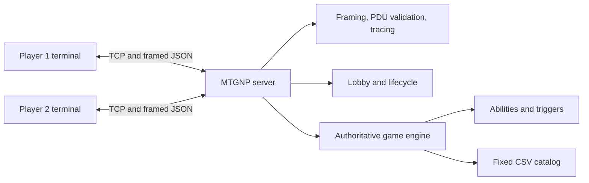
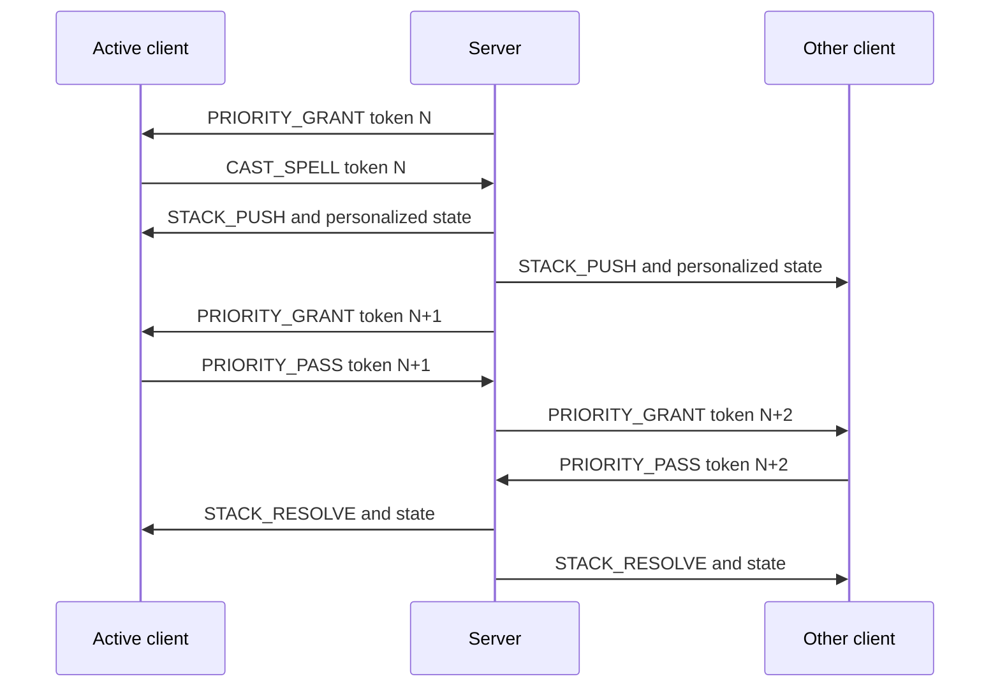
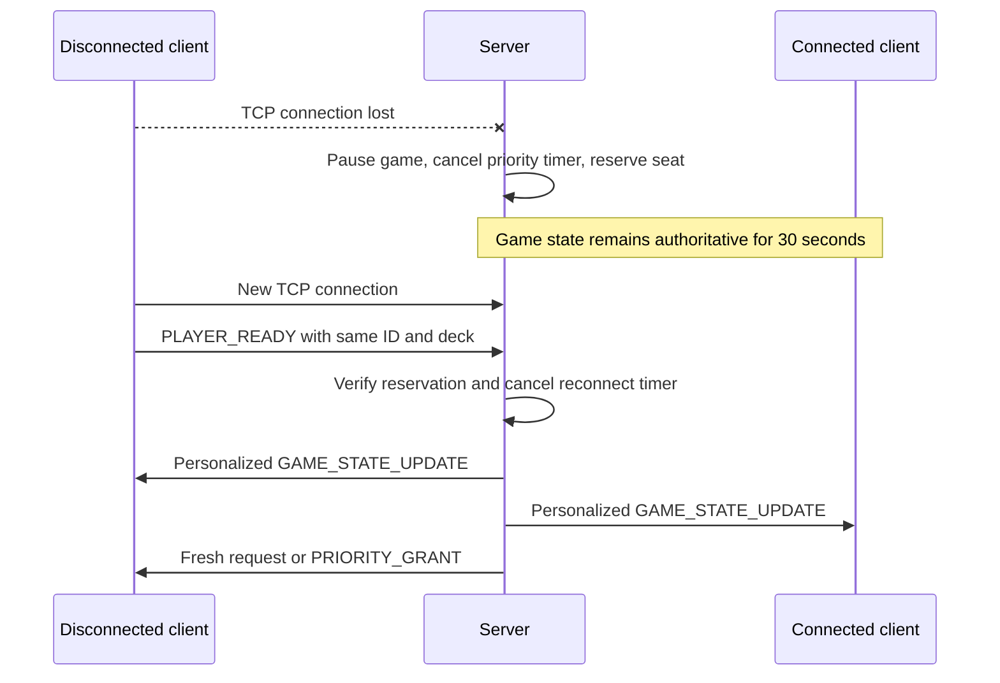

# Architecture and demo walkthrough

## Component view

`FramedConnection` owns exact-byte reads, the four-byte length prefix, PDU
validation, and tracing. `MTGNPServer` owns connections and translates valid
client intent into calls on `Lobby` or `GameSession`. `GameSession` is the only
authoritative game state. The terminal client renders server state and never
decides whether an action succeeds.

## Priority and Stack sequence

## Reconnect sequence

## Suggested oral walkthrough

1. Start the server and both clients with `--verbose`; point out the four-byte
   frame boundary and labeled send/receive logs.
2. Show two valid `PLAYER_READY` PDUs, personalized opening hands, and London
   Mulligan tokens.
3. Explain active player versus priority holder while playing a land, casting
   an Instant, passing twice, and resolving the Stack in LIFO order.
4. Demonstrate attacker and blocker declarations and identify the server-side
   validation that prevents illegal combat.
5. Stop one client during a priority prompt. Show that the opponent does not
   immediately win, then rerun the same command and show the fresh state/token.
6. Concede and show `GAME_OVER`, retained TCP connections, Lobby reset, and a
   second game beginning without restarting the server.
7. Show the automated tests and explain one malformed-frame test and one
   state-mutation atomicity test.

Every member should be able to explain the same path from received bytes,
through PDU validation and server dispatch, to game mutation and personalized
state broadcast.
